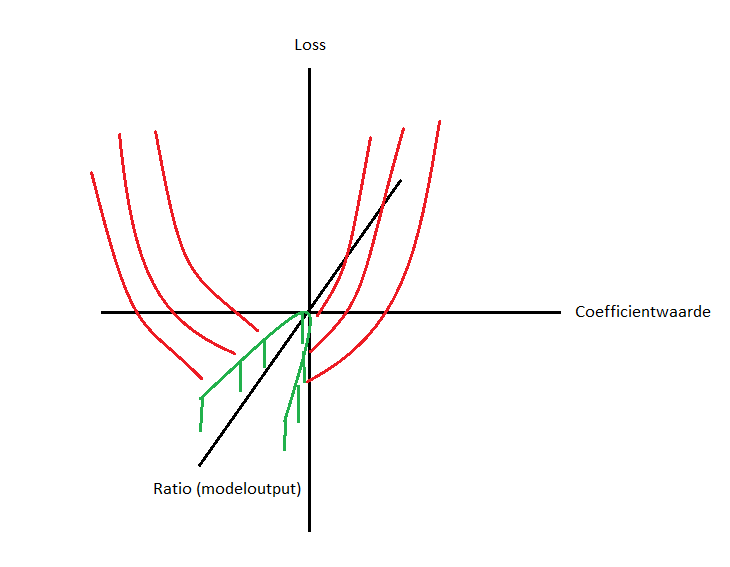

# Assessment of *Reweighting in ML4EFT*
## Noemenswaardigheden
- Er is door mij voor dit project best wat meer code geschreven dan er uiteindelijk in de repository branch te zien is. Een groot deel van het project zelf was ook het juist verkrijgen van de observable en weight data uit "raw" Les Houches Event files, het computationeel bepalen van truth values for benchmark tests, het juist herschalen van de verkregen data, etc. Om dit toch te kunnen laten zien, maar ook om het uiteindelijke resultaat van het project van begin tot eind te kunnen visualiseren, heb ik een extra notebook gemaakt, genaamd 'sample_pipeline.ipynb' in de main directory op de reweighting branch. Hierin laat ik zien wat er tussen het krijgen van gesimuleerde deeltjesfysica-data en het opleveren van een benchmark-plot moet gebeuren. De stappen die in dit notebook staan maken officieel geen deel uit van de implementatie van reweighting binnen ML4EFT, maar illustreren wel goed waar ik me in heb verdiept de afgelopen weken, dus ik zou jullie er toch graag op wijzen. Ik heb me hiervoor in een flink aantal wetenschappelijke python libraries als LHAPDF voor zogenoemde *parton distribution functions* en pylhe voor .lhe-verwerking verdiept, maar ook in deeltjesfysicasimulatiesoftware in C++ (zonder C++-ervaring) als [PYTHIA](https://www.pythia.org/), en ben zowel vanuit natuurkundig als programmeertechnisch oogpunt behoorlijk uit mijn comfortzone geweest.
- Een implementatie binnen 'classifier.py' waar ik best trots op ben is de penalty-term binnen de loss-functie. De andere contributors en ik kwamen namelijk het probleem tegen dat modellen soms buiten de fysisch mogelijke parabool in ($r$(ratio, modeloutput), $c$(Wilson-coefficientwaarde))-space kwamen, en soms bleef trainen. Dit kwam omdat de loss-functie zoals gedefiniëerd in de papers waar we mee werkten niet ongedefiniëerd was buiten deze parabool. Dit is alleen voor onze doeleinden niet interessant, omdat de oplossing waar we naar zoeken fysisch alleen kan bestaan binnen deze ruimte. Om er dus voor te zorgen dat de modellen altijd probeerden te convergeren binnen de fysisch mogelijke vlakken in parameter space, los van hoe de loss-functie daarbuiten gedefinieerd is, hebben we een soort "penalty"-term verzonnen. Er was namelijk op een (niet makkelijke) exacte manier te bepalen wanneer het model buiten dit fysische vlak zou vallen, namelijk als de discriminant van de parabool < 0, ofwel als geldt dat "nn_lin ** 2 - 4 * nn_quad > 0". Met een simpele ReLU-functie hebben we toen een "straf"-term in kunnen bouwen, die afhankelijk van hoe ver boven nul deze term lag een kwadratisch schalende extra term bij de loss optelde, om binnen de (loss, $r$, $c$)-ruimte een soort trechter te construeren die een onhandig trainend model terug naar fysisch mogelijke oplossingen leidt (regel 730 in core/classifier.py). Dit is simpel te visualiseren als , waarbij de groene parabool de ruimte is waar we het model naartoe willen krijgen en de rode lijnen een schematische weergave van de penaly-term. Deze samenkomst van puur analytische, exacte, theoretische natuurkunde en implementaties van (ml-)concepten in python zijn ook eigenlijk waarom ik deze minor wilde gaan doen, dus dit was een noemenswaardige toevoeging.
- Een noemenswaardigheid buiten de expliciete code om; in tegenstelling tot de meeste code die we tijdens de minor Programmeren hebben kunnen schrijven maakte ik tijdens dit project deel uit van een groep PhD-studenten, en had ik mijn eigen afgebakende deel van het framework waar ik aan werkte. Zoals kort besproken met Jelle en Wouter is dit anders dan bij andere programmeerprojecten, maar het was voor mij een erg waardevolle ervaring. Het werken binnen een gro(o)t(er)-schalig project is namelijk niet iets wat binnen de minor valt, en misschien ook niet iets wat je iemand aan kan leren, maar wel een belangrijk aspect van dit soort toepassingen van code naar mijn mening. De manier waarop je efficient of juist helemaal niet samenwerkt en delen van een codebase aanpast of juist laat zoals ze zijn zijn dingen die ik geleerd heb in de afgelopen paar weken, en waardoor ik in staat gesteld werd om nóg een waardevolle ervaring op te doen; het werken aan een project dat aan de frontlinie van een onderzoeksvlak staat. Over dit reweighting-project wordt volgend jaar door de andere contributors een paper geschreven waar ik ook aan mee mag helpen, omdat dit onderzoek echt nog door niemand gedaan is; niet alleen het framework zelf maar het onderzoeks-subveld dat het probeert open te breken is echt een nieuw iets en een actief gebied binnen de natuurkunde. Dit is in mijn optiek daarmee mijn eerste echte ervaring met het (zo goed mogelijk) toepassen van programmeertechnieken op huidige, onbeantwoorde vragen binnen de natuurkunde, wat ook een van de dingen is die ik hoopte te bereiken door deze minor te volgen. Het betekent echter ook dat we echt op onszelf aangewezen waren; de meeste problemen waar we tegen aangelopen zijn tijdens het schrijven van de code waren nergens op stackoverflow of de physics stackexchange te vinden, en om ze op te lossen hebben we een stuk minder op werk van anderen kunnen leunen dan ik gewend was. Dit was een goede ervaring, maar ook een beetje een vuurdoop voor het "echte" programmeren, en een waardoor ik toch iets trots ben dat ik de werkende code heb kunnen opleveren.

## Beslissingen
- De simulatie van het framework pre-reweighting was een stap verder dan de simulatie die we nu gebruikt hebben, namelijk op hadron-level in plaats van parton-level. Halverwege hebben we besloten om deze stap terug te nemen in de simulaties. Dit hebben we gedaan omdat het verkrijgen van de weights uit de hadron-simulatie een stuk meer werk was dan ik dacht dat het zou zijn, en deze extra simulatie concreet ook weinig zou toevoegen aan de initiële reweighting-implementatie, waarbij het werken van de software belangrijker is dan hoe goed het werkt. Dit heeft ervoor gezorgd dat het project binnen de tijd opgeleverd kon worden, maar is daarmee alleen uitgesteld, en moet in een later stadium nog steeds gedaan worden.
- Er is een behoorlijke breedte aan .lhe-verwerkingssoftware beschikbaar, waarbinnen pylhe, de software die ik nu gebruikt heb, niet per se de snelste of beste optie is. Het is wel een python-library, en omdat ik een groter vertrouwen had in mijn python-niveau dan in dat ik in een maand C++ tot op goed niveau zou kunnen leren was dat destijds de reden dat ik voor deze library gekozen heb. Voor vervolgwerk en wanneer dataverwerking opgeschaald moet worden is het handiger om naar een betere .lhe-verwerkingssoftware over te schakelen.